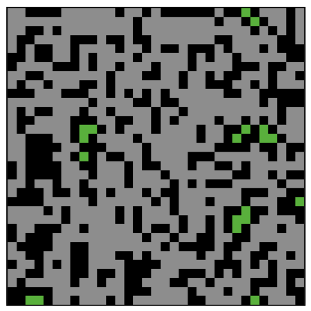
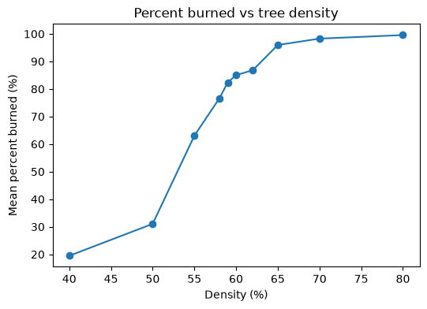

<!--
============================================================
ENVSCI 704 Assignment 2 template (fire-spread lab, Chapter 3.4)
============================================================
How to use this file:

1. In your GitHub course repo, create the folder `Assignment2/`
   and save this file there as `fire-spread.qmd`.
2. Fill in the YAML header above (your name and student ID).
3. Work through Parts A to C below. Every task needs code or a
   screenshot AND a short written answer.
4. Save screenshots as .png files in an `images/` folder next to
   this file (macOS: Cmd+Shift+4, Windows: Snipping Tool), then
   embed them like this:
       {width=70%}
5. Commit and push the .qmd AND the images/ folder, then paste
   the link on Canvas.

Tips:
- NetLogo code goes in netlogo-fenced code blocks, not Python cells.
- Give every screenshot a caption so the reader knows what it shows.
- If you build your Part B table in Excel, convert it with
  https://tabletomarkdown.com/convert-spreadsheet-to-markdown/
============================================================
-->

## Part A: Build the model

Paste your complete NetLogo code (the `globals`, `setup`, and `go` procedures):

```netlogo
globals [
  initial-trees
  burned-trees
]

to setup
  clear-all
  ask patches [
    if random 100 < density [ set pcolor green ]
  ]
  ask patches with [ pxcor = min-pxcor ] [
    if pcolor = green [ set pcolor red ]
  ]
  set initial-trees count patches with [ pcolor = green or pcolor = red ]
  set burned-trees 0
  reset-ticks
end

to go
  if not any? patches with [ pcolor = red ] [ stop ]
  ask patches with [ pcolor = red ] [
    ask neighbors4 with [ pcolor = green ] [
      set pcolor red
    ]
    set pcolor grey
    set burned-trees burned-trees + 1
  ]
  tick
end
```

**Task A1.** Embed your screenshot of the final state of the world at `density = 60`:

{width=70%}

**Task A2.** Percent burned at the end of the run: 97.23435225

## Part B: Find the critical density

**Task B1.** Complete the table: ten runs at each density, percent burned each time.

**Table 1:** Percentage of burned trees for ten density values, run ten times each, using the fire model in NetLogo. 

| Density | Run 1 | Run 2 | Run 3 | Run 4 | Run 5 | Run 6 | Run 7 | Run 8 | Run 9 | Run 10 | Mean |
|--------:|------:|------:|------:|------:|------:|------:|------:|------:|------:|-------:|-----:|
| 40      |86.9   |11.3   |17.9   |5.3    |10.0   |18.0   |9.2    |13.5   |16.3   |6.2     |19.46 |
| 50      |23.4   |21.6   |16.0   |33.5   |27.9   |59.4   |37.5   |33.6   |22.3   |35.3    |31.05 |
| 55      |24.4   |29.9   |79.1   |48.5   |81.7   |46.0   |78.4   |87.7   |75.8   |79.1    |63.06 |
| 58      |83.7   |87.5   |92.4   |42.0   |86.4   |85.7   |59.7   |75.5   |81.7   |81.5    |76.61 |
| 59      |86.1   |85.1   |81.7   |85.0   |75.7   |83.9   |83.9   |75.7   |78.4   |88.4    |82.39 |
| 60      |89.8   |93.2   |90.1   |89.9   |91.3   |86.3   |92.3   |66.7   |93.0   |57.7    |85.03 |
| 62      |82.7   |92.8   |76.7   |76.0   |95.1   |86.2   |84.6   |88.2   |94.9   |91.0    |86.82 |
| 65      |97.7   |98.2   |97.9   |93.4   |98.2   |98.8   |91.0   |94.1   |96.2   |94.3    |95.97 |
| 70      |98.2   |98.3   |98.1   |97.5   |99.0   |99.1   |96.0   |99.1   |99.5   |98.0    |98.28 |
| 80      |97.5   |99.9   |99.7   |100.0  |99.8   |99.8   |99.7   |99.6   |99.8   |99.9    |99.57 |


**Task B2.** Plot mean percent burned vs density. By hand or Excel: embed a photo or screenshot. In Python: use the code cell below.

```{python}
#| eval: false
import matplotlib.pyplot as plt

density = [40, 50, 55, 58, 59, 60, 62, 65, 70, 80]
mean_burned = [19.46, 31.05, 63.06, 76.61, 82.39, 85.03, 86.82, 95.97, 98.28, 99.57]  # fill in your means

fig, ax = plt.subplots(figsize=(6, 4))
ax.plot(density, mean_burned, marker="o")
ax.set_xlabel("Density (%)")
ax.set_ylabel("Mean percent burned (%)")
ax.set_title("Percent burned vs tree density")
plt.show()
```

{width=70%}

**Task B3 (critical-density estimate).** 

**Task B4 (variability near the threshold).** 


## Part C: Summary ODD documentation

Replace each `<...>` placeholder with your own text about the fire model. Keep the **bold** phrases as they are and keep ODD's key words in *italics*. Aim for one short paragraph per element. 

**The overall *purpose* of our model is** \<what question does the model address? 1 to 2 sentences.\> **Specifically, we are addressing the following questions:** \<e.g. how does the burned area respond to tree density?\> **To consider our model realistic enough for its purpose, we use the following *patterns*:** \<what real-world patterns should the model reproduce, e.g. a sharp threshold in fire spread?\>

**The model includes the following *entities*:** \<list them, e.g. patches representing trees.\> **The *state variables* characterising these entities are listed in Table 1.** **The *spatial* and *temporal* resolution and extent are** \<world size in patches, what one patch and one tick represent, and when a run ends.\>

**The most important *processes* of the model, which are repeated every *time step*, are** \<what happens each tick, in order — use the same names as in your code, e.g. ignition of neighbours, burnout.\>

**The most important *design concepts* of the model are** \<e.g. emergence: the critical density threshold emerges from purely local spread rules; stochasticity: random tree placement.\>

**The model is initialized with** \<initial conditions: how trees are placed, where the fire starts, and the slider settings used.\>

**Table 1.** Entities and state variables of the model.

| Entity | Variable | Description | Possible values | Units |
|--------|----------|-------------|-----------------|-------|
| Patch  | `pcolor` |             |                 |       |
| Global | `density`|             |                 |       |
| ...    |          |             |                 |       |

