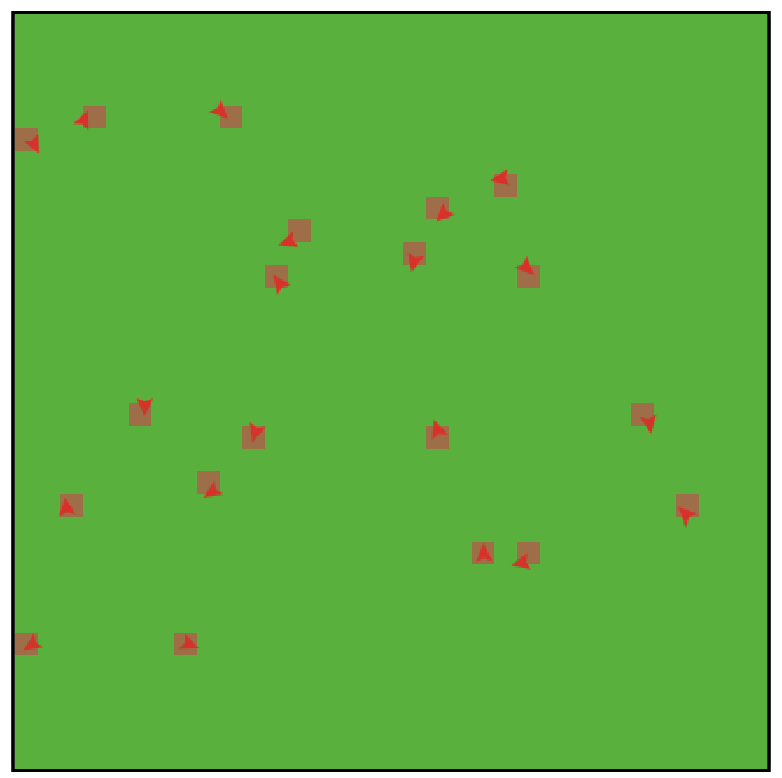
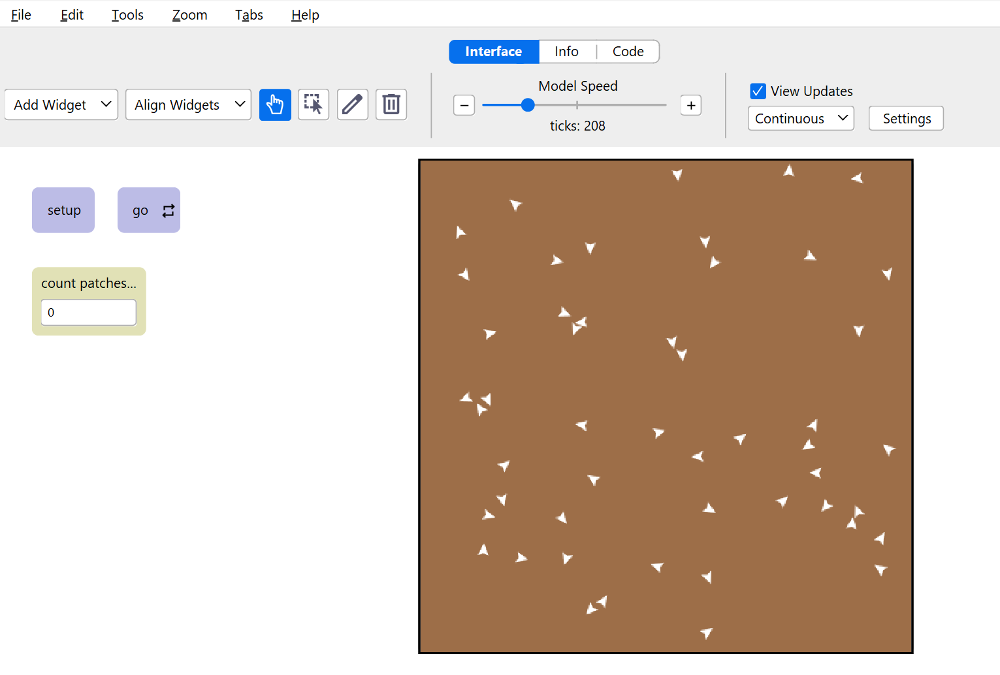

<!--
============================================================
ENVSCI 704 lab template (Week 3: agent-based modelling)
============================================================
How to use this file:

1. Copy it into your GitHub course repo and rename it, e.g.
   `lab-03-fire-spread.qmd`.
2. Fill in the YAML header above (title, your name, student ID).
3. Work through the tasks below. Delete any sections you do not need.
4. Render to PDF:
       quarto render lab-03-topic.qmd --to pdf
5. Commit and push the .qmd, the rendered .pdf, AND your images/
   folder. Submit the link to the PDF on Canvas.

Tips:
- NetLogo code goes in netlogo-fenced code blocks, not Python cells.
- Write short answers in prose between code blocks and screenshots,
  not as comments inside code.
- Give every screenshot a caption so the reader knows what it shows.
- If you plot in Python, round floats when you print: f"{value:.2f}".
============================================================
-->

## How to include screenshots and images (jpg or png)

Your NetLogo results are reported as screenshots, so you will embed external image files in this document.

1. Take a screenshot of the NetLogo world or interface (on macOS press Cmd+Shift+4, on Windows use Snipping Tool).
2. Save it as a `.png` or `.jpg` file inside an `images/` folder next to this `.qmd` file, with a descriptive name such as `images/fire-density60.png`.
3. Embed it with Markdown image syntax, and add a caption and a width:

```markdown
{width=70%}
```

Because `embed-resources: true` is set in the YAML header, the images are bundled into the rendered HTML file. Remember to commit and push the `images/` folder along with the `.qmd`, otherwise the images will be missing when the file is rendered elsewhere.

## Part A: Command Center warm-up

This model simulates 20 agents where the patch colour is altered if the agent is on it. 

**Note** all code was done in the command centre... not code...

```lisp
;; 
create-turtles 20
ask turtles [ setxy random-xcor random-ycor ]
ask turtles [ set color red ]
ask patches [ set pcolor green ]
ask turtles [ forward 3 ]
ask turtles [ right random 360 forward 2 ]
ask turtles [ if pcolor = green [ set pcolor brown ] ]
show count turtles
show count patches with [ pcolor = green ]
```
**Answer to task A1:** _(one to three sentences)_

{width=70%}

**Answer to task A2:** _(one to three sentences)_

The two show commands are counting the number of turtles (agents) that are within the model, and the number of patches that remain green (i.e. not turned brown)

## Part B: Build a “wandering agents” model

This model simulates 20 agents where the patch colour is altered if the agent is on it. 

```lisp
;; 
to setup
  clear-all
  ask patches [ set pcolor green ]
  create-turtles 50 [
    setxy random-xcor random-ycor
    set color white
  ]
  reset-ticks
end

to go
  ask turtles [
    right random 50
    left random 50
    forward 1
    if pcolor = green [ set pcolor brown ]
  ]
  tick
end
```
**Answer to task B1:**

{width=70%}

**Answer to task B2:**
0

**Answer to task B3:**

The monitor value slows down as it changes over time. This is because as fewer 'green' patches are left and the likelihood of a turtle interacting with the green patch, and thus turn it brown, is reduced. 

Record your runs in a Markdown table:

| Parameter value | Run 1 | Run 2 | Run 3 | Mean |
|----------------:|------:|------:|------:|-----:|
|                 |       |       |       |      |
|                 |       |       |       |      |

If you plot your results in Python, use a code cell:

```{python}
#| eval: false
import matplotlib.pyplot as plt

fig, ax = plt.subplots(figsize=(6, 4))
# ax.plot(...)
ax.set_xlabel("...")
ax.set_ylabel("...")
ax.set_title("...")
plt.show()
```


## Part C: Model extension

Paste the modified NetLogo code and embed a screenshot of the extended model:

```netlogo
;; 
to setup
  clear-all
  ask patches [ set pcolor green ]
  create-turtles 200 [
    setxy random-xcor random-ycor
    set color white
  ]
  reset-ticks
end

to go
  ask turtles [
    right random 50
    left random 50
    forward 1
    if pcolor = green [ set pcolor brown ]
  ]
  tick
end
```

**Answer to task C1**

It takes much less time to turn the world darker (c. 60 ticks to do so) when there are more turtles.

**Answer to task C2**

The world darkens much faster again (less than 40-50 ticks)

{width=70%}

**Answer to task C1:** _(short answer)_


## Checklist before you push

- [ ] Every task has code or a screenshot **and** a short answer
- [ ] Every screenshot has a caption, and every plot has axis labels and a title
- [ ] The `images/` folder is committed and pushed together with the `.qmd`
- [ ] Your name and student ID are in the YAML header
- [ ] The file renders cleanly (no missing images or red error boxes in the HTML output)
- [ ] Filename is `lab-03-topic.qmd`, not `Untitled.qmd`

